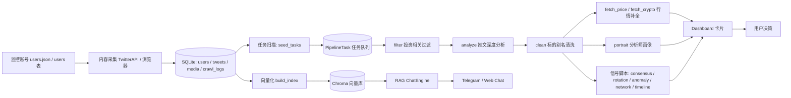
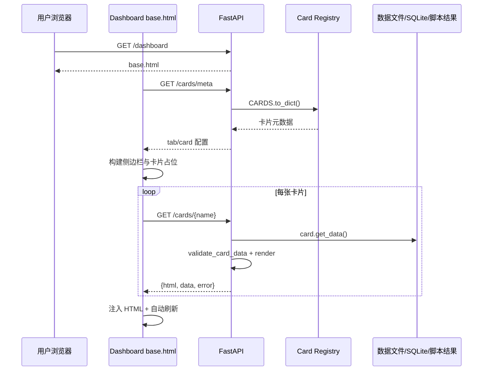
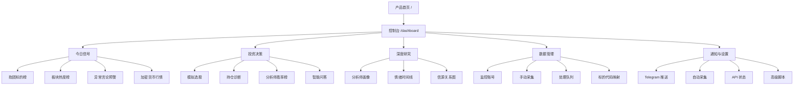

# Twitter Investor Distiller 产品信息架构梳理与优化建议

> 生成日期：2026-06-10
> 分析对象：当前 `推特用户蒸馏 / Twitter Investor Distiller` 网站产品代码与页面实现
> 分析范围：FastAPI 路由、Landing Page、Dashboard、卡片系统、流水线任务、数据与 AI/RAG 模块、主要脚本与页面命名。

---

## 0. 结论摘要

当前产品已经不是一个简单的爬虫工具，而是一个「投资研究信号操作台」：它覆盖了从 X/Twitter 投资者内容采集、AI 过滤与分析、行情补全、画像生成、信号聚合、持仓/选股辅助，到 Telegram 推送与系统运维的完整闭环。

但当前信息架构仍带有明显的「工程控制台」特征：

1. **核心价值链已形成，但用户路径没有完全围绕价值链组织。** 现有 Dashboard 按「今日概览 / 决策分析 / 信号深挖 / 分析师画像 / 系统运维」分组，方向正确；但「任务执行台」「手动拉取」「脚本工具箱」等运维入口仍暴露较重。
2. **卡片体系已经具备较好的模块化基础。** `CARD_CONFIG` 和 `CARD_DISPLAY` 已将 19 张卡片集中配置，前端通过 `/cards/meta` 自动发现，再按卡片加载 `/cards/{name}`，符合卡片式 IA 的演进方向。
3. **用户可见命名已有一次优化，但仍有少数内部术语需要产品化。** 例如「种子任务」「运行校准」「Daemon」「流水线」「画像」等，对开发者清晰，对普通投资研究用户仍偏技术。
4. **当前应优先优化导航层级与任务命名，而不是重写功能。** 大部分问题可以通过显示名、分组、入口层级、默认首页顺序和帮助文案解决，代码改动风险较低。

建议将产品主心智从「系统运维仪表盘」调整为：

> **今日看什么 → 为什么值得看 → 要不要操作 → 系统是否正常**

推荐一级导航：

1. **今日信号**：共识、板块热度、异常提醒、系统摘要
2. **投资决策**：模拟选股、持仓诊断、分析师胜率、加密货币行情
3. **深度研究**：情绪时间线、信源关系、分析师画像
4. **数据管理**：监控账号、手动采集、任务队列、代码映射
5. **通知与设置**：Telegram、自动采集、脚本工具、API 状态

---

## 1. 网站功能模块总览

### 1.1 当前主要页面入口

| 页面/入口 | 路由 | 代码位置 | 当前作用 | IA 评价 |
|---|---|---|---|---|
| 产品首页 | `/` | `src/interfaces/web_api.py:1014`；`src/templates/landing.html` | 展示产品价值、五大能力、进入控制台 | 文案方向正确，但「查看文档」链接仍指向 GitHub 泛链接 |
| 控制台首页 | `/dashboard` | `src/interfaces/web_api.py:1031`；`src/templates/base.html` | 卡片式 Dashboard 主页面 | 当前核心产品界面 |
| 卡片元数据 | `/cards/meta` | `src/interfaces/web_api.py:815` | 返回所有卡片配置，用于前端自动构建导航 | 架构清晰，适合继续扩展 |
| 卡片内容 | `/cards/{name}` | `src/interfaces/web_api.py:830` | 返回 `{html, data, error}` 信封结构 | 符合现有前端宪章 |
| 卡片动作 | `/cards/{name}/action` | `src/interfaces/web_api.py:880` | 统一处理卡片交互动作 | 后续可继续拆成领域服务 |
| 任务 API | `/pipeline/tasks/*` | `src/interfaces/web_api.py:159` 起 | 管理流水线任务列表、执行、跳过、重试、编辑、种子扫描 | 功能完整，但命名偏工程化 |
| 时间线 HTML | `/timeline/{path}` | `src/interfaces/web_api.py:1052` | 读取 `data/timeline` 中的静态图表 | 可作为「深度研究」内容入口 |

### 1.2 当前一级导航 / Tab

来源：`src/cards/cards_config.py`。

| 当前 Tab | 代表用户心智 | 卡片 | 评价 |
|---|---|---|---|
| 今日概览 | 每天打开第一眼看到什么 | 抱团标的榜、系统概览、板块热度榜、加密货币行情 | 方向正确，但系统概览可弱化，不应比投资信号更抢眼 |
| 决策分析 | 该买什么 / 该卖什么 | 模拟选股、持仓诊断、分析师胜率榜 | 价值最高，应作为第二甚至第一主入口 |
| 信号深挖 | 花时间仔细看 | 异常言论预警、情绪时间线、信源关系图 | 适合作为研究型页面 |
| 分析师画像 | 了解谁在说话 | 画像档案、生成新画像 | 可并入「深度研究」，也可保留独立入口 |
| 系统运维 | 保持引擎运转 | 任务执行台、自动采集开关、采集状态、手动拉取、代码别名库、脚本工具箱、Telegram 推送 | 当前过重，建议拆为「数据管理」和「通知与设置」 |

### 1.3 核心功能模块

| 模块 | 当前功能 | 主要文件 | 面向用户的任务 |
|---|---|---|---|
| 内容采集模块 | 从指定 X/Twitter 用户拉取推文、回复、媒体 | `src/crawler/twitterapi_fetcher.py`、`src/interfaces/handlers_exec.py`、`src/cards/tool_cards.py` | 更新目标分析师内容 |
| 监控账号模块 | 添加/移除被跟踪账号，展示各账号采集状态 | `src/interfaces/handlers_data.py`、`src/cards/pipeline_control.py`、`data/users.json` | 管理研究对象 |
| 流水线任务模块 | 扫描任务、过滤、分析、拉价、画像、清洗、重试、跳过 | `src/pipeline/task_executor.py`、`src/cards/pipeline_execute.py`、`src/interfaces/web_api.py` | 把原始推文加工成投资信号 |
| AI 分析模块 | LLM 过滤投资相关性、深度分析、画像生成 | `src/pipeline/task_executor.py`、`src/ai/llm_client.py`、`src/ai/distiller.py` | 提取观点、立场、标的、置信度 |
| 投资信号模块 | 共识榜、板块轮动、异常检测、情绪时间线、信源网络 | `src/cards/consensus.py`、`rotation.py`、`anomaly.py`、`network.py`、`scripts/compute_*.py` | 发现值得关注的信号 |
| 决策辅助模块 | 模拟选股、持仓诊断、准确率回测 | `src/cards/interactive_cards.py`、`src/interfaces/handlers_insights.py`、`src/cards/accuracy.py` | 辅助买卖和组合判断 |
| 分析师画像模块 | 浏览/生成不同窗口的投资风格画像 | `src/cards/tool_cards.py`、`src/cards/pipeline_execute.py` | 理解信息源风格和偏好 |
| RAG 问答模块 | 基于向量检索推文上下文回答问题 | `src/ai/chat_engine.py`、`src/vectorization/*` | 用自然语言查询历史观点 |
| 通知模块 | Telegram 配置与测试推送 | `src/cards/interactive_cards.py`、`src/templates/cards/telegram.html` | 接收重要信号通知 |

### 1.4 附加/运维功能模块

| 模块 | 当前作用 | IA 建议 |
|---|---|---|
| 自动采集开关 | 启停后台采集进程 | 放入「通知与设置」或「数据管理」二级区域，不建议首页展示 |
| 采集状态 | 展示 API 额度、限流、各账号采集条数 | 可保留在顶部状态栏，并在数据管理页展开 |
| 手动拉取 | 指定账号和时间范围补抓 | 改名为「补采数据」或「手动采集」 |
| 代码别名库 | 维护公司名、别名与 ticker 映射 | 改名为「标的代码映射」 |
| 脚本工具箱 | 手动触发底层脚本 | 默认折叠，定位为高级工具 |
| 任务执行台 | 查看和执行 PipelineTask | 面向普通用户建议命名为「任务队列」或「处理队列」 |

---

## 2. 模块关系与数据流说明

### 2.1 当前主数据流

### 2.2 当前前端加载流

### 2.3 关键依赖关系

| 上游 | 下游 | 说明 | 风险 |
|---|---|---|---|
| 监控账号 | 采集、画像、状态卡片 | `data/users.json` 是多个模块共同依赖 | 用户管理应独立成清晰入口 |
| SQLite tweets | 过滤/分析/向量化/状态统计 | 原始数据源 | 当前缺少「数据新鲜度」强提示 |
| PipelineTask | 任务执行台、画像生成、采集处理 | 核心任务队列 | 任务类型偏工程，普通用户不易理解 |
| `stock_alias.csv` | 清洗、行情拉取、持仓/选股准确性 | 标的识别质量关键 | 当前叫「代码别名库」，建议改为「标的代码映射」 |
| `data/pipeline/*.json/md` | 卡片展示、画像、选股、持仓诊断 | 许多结果来自文件系统 | 后续生产化要迁移到结构化存储 |
| Chroma 向量库 | RAG 问答 | 语义检索基础 | Web UI 当前没有显式问答入口或不够突出 |
| 脚本输出目录 | consensus/rotation/anomaly/timeline/network 卡片 | 信号展示依赖离线脚本 | 用户应看到「最后生成时间 / 数据是否过期」 |

### 2.4 强耦合、重复和孤立点

| 问题 | 表现 | 建议 |
|---|---|---|
| 运维功能过度集中 | 「系统运维」包含任务、采集、代码映射、脚本、Telegram | 拆成「数据管理」和「通知与设置」 |
| 任务模型与用户语言不一致 | `filter/analyze/fetch_price/fetch_crypto/portrait/clean` 直接暴露 | 前端展示改为「筛选推文 / 分析观点 / 补全行情 / 生成画像 / 校准标的」 |
| 代码映射重复入口 | `asset_alias` 独立卡片与 `pipeline_execute` 的 clean tab 均有资产映射管理 | 保留一个主入口，另一个做快捷入口或移除 |
| RAG 问答入口不突出 | `ChatEngine` 已有，但当前卡片导航没有明显「问答」模块 | 建议新增「智能问答」或放入「投资决策」 |
| 脚本工具箱面向开发者 | 普通用户不知道何时运行哪个脚本 | 默认隐藏为高级设置，关键脚本封装成产品动作 |

---

## 3. 当前信息架构问题清单

### 3.1 新用户第一次进入的问题

当前 Landing Page 已清楚表达：采集推文 → AI 过滤 → 深度分析 → 量化信号 → 生成决策。问题是进入控制台后，页面立即切到卡片 Dashboard，但缺少一个明确的「下一步」。

建议在「今日概览」顶部新增一个轻量引导区：

- 如果没有数据：提示「先添加监控账号 / 手动采集 / 生成任务」。
- 如果有原始数据但无分析：提示「有 X 条新推文待分析，去处理队列」。
- 如果有分析结果：提示「今日重点：X 个共识标的、Y 个异常变化、Z 个待处理任务」。

### 3.2 高频任务不够靠前

对用户来说，高频任务大概率是：

1. 看今天有哪些重点标的和板块；
2. 判断某只股票是否值得关注；
3. 看某位分析师最近观点；
4. 输入自己的持仓做诊断；
5. 确认数据是否已更新。

当前「系统概览」和「系统运维」权重偏高，而「智能问答」入口不明显。建议把「投资信号」和「决策辅助」继续前置，把运维动作折叠。

### 3.3 导航分组仍有技术导向

当前「系统运维」是工程视角。对用户更自然的分法是：

- 数据从哪里来：监控账号、手动采集、自动采集；
- 数据处理到哪一步：任务队列、处理进度、失败重试；
- 结果如何使用：今日信号、决策分析、深度研究；
- 通知和配置：Telegram、代码映射、API 状态、高级工具。

### 3.4 页面/卡片命名存在认知成本

典型例子：

| 当前名称 | 问题 |
|---|---|
| 种子任务 | 开发者术语，用户不知道是「生成待处理任务」 |
| 任务执行台 | 偏后台管理，不像投资产品 |
| Daemon / 自动采集开关 | Daemon 不应出现在用户界面 |
| 运行校准 | 不清楚校准什么 |
| 代码别名库 | 「代码」容易理解为程序代码，不是股票代码 |
| 画像 | 可保留，但建议首次出现写成「分析师画像」 |
| 信源关系图 | 对老用户准确，但新用户可能不懂「信源」 |

---

## 4. 推荐的新信息架构方案

### 4.1 推荐一级导航

| 推荐导航 | 目标用户问题 | 建议包含模块 |
|---|---|---|
| 今日信号 | 今天最值得看什么？ | 抱团标的榜、板块热度榜、异常言论预警、加密货币行情、系统数据摘要 |
| 投资决策 | 我该买/卖/持有什么？ | 模拟选股、持仓诊断、分析师胜率榜、智能问答 |
| 深度研究 | 为什么？谁说的？历史怎么看？ | 情绪时间线、信源关系图、分析师画像档案、画像生成 |
| 数据管理 | 数据是否新鲜？如何补数据？ | 监控账号、手动采集、处理队列、标的代码映射、采集状态 |
| 通知与设置 | 怎么自动化和配置？ | Telegram 推送、自动采集、API 状态、脚本工具箱 |

### 4.2 推荐页面结构

### 4.3 与当前 `CARD_CONFIG` 的映射建议

| 当前 card name | 当前显示名 | 当前 Tab | 建议 Tab | 建议显示名 |
|---|---|---|---|---|
| `consensus` | 抱团标的榜 | 今日概览 | 今日信号 | 共识标的 |
| `rotation` | 板块热度榜 | 今日概览 | 今日信号 | 热门板块 |
| `anomaly` | 异常言论预警 | 信号深挖 | 今日信号 / 深度研究 | 观点异动 |
| `crypto` | 加密货币行情 | 今日概览 | 今日信号 | 加密资产信号 |
| `role_picker` | 模拟选股 | 决策分析 | 投资决策 | 分析师模拟选股 |
| `portfolio` | 持仓诊断 | 决策分析 | 投资决策 | 我的持仓诊断 |
| `accuracy` | 分析师胜率榜 | 决策分析 | 投资决策 | 历史胜率 |
| `timeline` | 情绪时间线 | 信号深挖 | 深度研究 | 观点时间线 |
| `network` | 信源关系图 | 信号深挖 | 深度研究 | 信息源关系 |
| `portrait` | 画像档案 | 分析师画像 | 深度研究 | 分析师画像 |
| `portrait_generate` | 生成新画像 | 分析师画像 | 深度研究 / 数据管理 | 生成分析师画像 |
| `pipeline_execute` | 任务执行台 | 系统运维 | 数据管理 | 处理队列 |
| `fetch_control` | 手动拉取 | 系统运维 | 数据管理 | 手动采集 |
| `asset_alias` | 代码别名库 | 系统运维 | 数据管理 | 标的代码映射 |
| `api_status` | 采集状态 | 系统运维 | 数据管理 / 通知与设置 | 采集状态 |
| `daemon` | 自动采集开关 | 系统运维 | 通知与设置 | 自动采集 |
| `telegram` | Telegram 推送 | 系统运维 | 通知与设置 | 推送通知 |
| `script_runner` | 脚本工具箱 | 系统运维 | 通知与设置 | 高级工具 |
| `system_status` | 系统概览 | 今日概览 | 今日信号 / 数据管理 | 数据状态 |

---

## 5. 页面与用户路径优化建议

### 5.1 路径一：每日查看

**当前路径**：进入控制台 → 今日概览 → 共识/系统/板块/加密。
**建议路径**：进入控制台 → 今日信号 → 默认突出「共识标的 + 观点异动 + 热门板块」。

建议调整：

1. 「系统概览」降权为顶部状态摘要，不占主要卡片位。
2. 「异常言论预警」前移到今日信号，因为它属于高价值提醒。
3. 每张信号卡增加「为什么出现」或「查看来源」入口，避免只看结果。

### 5.2 路径二：研究某个标的

**目标问题**：我想知道某个股票最近有没有被分析师提到、态度如何、是否适合持有。

当前缺口：没有明确的「搜索/问答」入口。虽然 `ChatEngine` 已实现 RAG，但 Dashboard 导航没有突出。

建议新增卡片：

- 名称：`智能问答` / `问分析师库`
- 入口位置：投资决策第一屏或顶部搜索框
- 示例问题：
  - “TJ 最近怎么看 NVDA？”
  - “dearbaibabybus 最近提到过哪些 AI 应用股？”
  - “过去 30 天哪些标的出现观点反转？”

### 5.3 路径三：更新数据

**当前路径**：系统运维 → 手动拉取 / 自动采集 / 任务执行台 / 种子任务。
**问题**：用户要理解「采集」和「种子任务」之间的关系。

建议改为向导式三步：

1. **采集内容**：选择账号 + 时间范围；
2. **生成处理任务**：扫描新内容并生成待处理项；
3. **运行处理队列**：过滤、分析、补行情、生成画像。

前端可以不重写，只需在「数据管理」页顶部增加一个流程提示条。

### 5.4 路径四：新增分析师

当前新增用户在 `api_status` 相关用户管理中，入口不够产品化。建议：

- 新增卡片/区域名：「监控账号」；
- 包含：账号列表、添加账号、启用/停用、最近采集时间、推文数量、限流状态；
- 添加后给出下一步按钮：「立即采集」「稍后自动采集」。

### 5.5 路径五：配置通知

Telegram 推送应从「系统运维」移到「通知与设置」。建议增加触发规则说明：

- 推送什么：异常言论、共识标的、任务失败；
- 什么时候推送：实时 / 每日摘要；
- 推送到哪里：Telegram chat id。

---

## 6. 功能命名优化表

参考同类 SaaS Dashboard、数据管道、投资研究产品的常见命名习惯，用户可见名称应避免工程内部词，优先采用「任务对象 + 用户动作/结果」的表达。

| 当前名称 | 问题类型 | 替代名称候选 | 推荐名称 | 替换理由 |
|---|---|---|---|---|
| 种子任务 | 内部工程术语 | 生成待处理任务 / 扫描新内容 / 创建处理队列 | **扫描新内容** | 用户理解为“把新采集内容找出来”，比 seed 更直观 |
| 任务执行台 | 偏后台系统 | 处理队列 / 任务队列 / 数据处理 | **处理队列** | Data pipeline 产品常用 Queue/Jobs/Runs，但中文用户更懂“处理队列” |
| 流水线执行 | 技术术语 | 数据处理 / 信号生成 / 运行分析流程 | **运行分析流程** | 强调用户收益：把数据变成分析结果 |
| 过滤筛选 | 可理解但略重复 | 投资相关筛选 / 筛选推文 | **筛选推文** | 明确对象是推文 |
| 推文分析 | 可保留 | 分析观点 / 深度分析 | **分析观点** | 更贴近投资研究语义 |
| 股价拉取 | 技术动作 | 补全行情 / 获取行情 | **补全行情** | 说明为什么要拉价：为了后续分析完整 |
| 加密货币 | 过于宽泛 | 补全加密行情 / 加密资产行情 | **补全加密行情** | 与股价拉取保持一致 |
| 数据清洗 | 技术词 | 校准标的 / 修正识别结果 | **校准标的** | 对投资用户更清楚：校准股票/ETF/币种识别 |
| 运行校准 | 缺少对象 | 校准标的代码 / 应用映射修正 | **应用映射修正** | 说明动作是把映射应用到分析结果 |
| 代码别名库 | 容易误解为程序代码 | 股票代码映射 / 标的别名映射 / 标的代码映射 | **标的代码映射** | 覆盖股票、ETF、指数、加密资产 |
| 别名 | 单独出现时模糊 | 提及名称 / 别称 / 原文名称 | **提及名称** | 说明它来自推文原文 |
| Ticker | 英文金融术语 | 股票代码 / 标的代码 | **标的代码** | 覆盖非股票资产 |
| Daemon | 技术黑话 | 自动采集 / 后台采集 / 定时采集 | **自动采集** | 用户只关心是否自动更新 |
| 系统运维 | 偏工程 | 数据管理 / 通知与设置 / 高级工具 | **拆分为数据管理、通知与设置** | 运维不是投资用户心智 |
| 系统概览 | 泛化 | 数据状态 / 今日数据状态 | **数据状态** | 让用户知道这是数据新鲜度和系统健康 |
| 采集状态 | 可保留 | 数据源状态 / 账号采集状态 | **账号采集状态** | 更明确是各账号数据状态 |
| 手动拉取 | 口语但不完整 | 手动采集 / 补采数据 | **手动采集** | 行业通用，动作清楚 |
| 抱团标的榜 | 有风格但略口语 | 共识标的 / 热门共识 / 分析师共识 | **共识标的** | 更像投资研究产品命名 |
| 板块热度榜 | 可保留 | 热门板块 / 板块轮动 | **热门板块** | 更短，适合导航和卡片标题 |
| 异常言论预警 | 稍长 | 观点异动 / 异常观点 / 态度转折 | **观点异动** | 强调分析师观点变化，不像风控系统 |
| 情绪时间线 | 可保留 | 观点时间线 / 情绪走势 | **观点时间线** | “情绪”可能过窄，观点更贴投资研究 |
| 信源关系图 | 新用户不一定懂 | 信息源关系 / 分析师关系图 | **信息源关系** | 更通用，更符合图谱类功能 |
| 画像档案 | 可保留但略抽象 | 分析师画像 / 投资风格画像 | **分析师画像** | 明确对象 |
| 生成新画像 | 动词清楚但对象略省略 | 生成分析师画像 / 更新画像 | **生成分析师画像** | 更完整 |
| 模拟选股 | 可保留 | 分析师模拟选股 / 风格选股 | **分析师模拟选股** | 明确是代入分析师风格 |
| 持仓诊断 | 可保留 | 我的持仓诊断 / 组合诊断 | **我的持仓诊断** | 更个人化，适合用户入口 |
| 脚本工具箱 | 开发者导向 | 高级工具 / 维护工具 / 手动工具 | **高级工具** | 降低普通用户干扰 |

---

## 7. 优先级排序

### 7.1 立即修改（低风险，高收益）

| 优先级 | 建议 | 主要改动文件 |
|---|---|---|
| P0 | 将「种子任务」改为「扫描新内容」 | `src/cards/pipeline_execute.py` 文案 |
| P0 | 将「任务执行台」改为「处理队列」 | `src/cards/cards_config.py` 的 `CARD_DISPLAY` |
| P0 | 将「代码别名库」改为「标的代码映射」 | `src/cards/cards_config.py`、`pipeline_execute.py`、`functional_cards.py` |
| P0 | 将「系统运维」拆为「数据管理」「通知与设置」 | `src/cards/cards_config.py` |
| P0 | 将「Daemon 运行中」改为「自动采集运行中」 | `src/templates/base.html` |
| P1 | 将「运行校准」改为「应用映射修正」 | `src/cards/pipeline_execute.py` |
| P1 | 将 `fetch_price/fetch_crypto` 展示名改为「补全行情 / 补全加密行情」 | `src/cards/pipeline_execute.py` |

### 7.2 后续优化（中等改动）

| 优先级 | 建议 | 说明 |
|---|---|---|
| P1 | 新增「智能问答」卡片 | 复用 `ChatEngine`，作为投资决策主入口 |
| P1 | 新增「监控账号」独立卡片 | 从 `api_status` 中拆出用户管理，降低入口隐藏问题 |
| P1 | 数据管理页增加三步流程条 | 「采集内容 → 扫描新内容 → 运行分析流程」 |
| P2 | 每个信号卡增加数据新鲜度 | 显示最后更新时间、数据窗口、来源数量 |
| P2 | 将脚本工具箱默认折叠到高级区域 | 避免普通用户误触 |
| P2 | 将资产映射的重复入口合并 | `asset_alias` 和 `pipeline_execute clean tab` 二选一作为主入口 |

### 7.3 暂不处理

| 建议 | 暂缓理由 |
|---|---|
| 全面重构前端框架 | 当前原生 JS + 卡片 API 已可支撑自用工具，重构收益不如 IA 文案和入口优化 |
| 拆微服务 | 当前仍是单用户/小规模工具，先保持模块化单体更稳 |
| 将所有文件结果迁入数据库 | 对生产化有价值，但不是本次 IA 优化的首要瓶颈 |

---

## 8. 建议修改文件路径与改动点

> 以下仅列建议，不直接修改代码。

### 8.1 `src/cards/cards_config.py`

建议改动：

1. 调整 `CARD_CONFIG` 的 tab 分组：
   - `overview` → `signals`，显示「今日信号」；
   - `decisions` 保留或显示「投资决策」；
   - `deep_dive + profiles` 合并为 `research`，显示「深度研究」；
   - `operations` 拆为 `data`「数据管理」和 `settings`「通知与设置」。
2. 调整 `CARD_DISPLAY`：
   - `pipeline_execute`: 「任务执行台」→「处理队列」；
   - `asset_alias`: 「代码别名库」→「标的代码映射」；
   - `daemon`: 「自动采集开关」→「自动采集」；
   - `script_runner`: 「脚本工具箱」→「高级工具」；
   - `system_status`: 「系统概览」→「数据状态」。

### 8.2 `src/cards/pipeline_execute.py`

建议改动：

1. `type_names`：
   - `filter`: 「过滤筛选」→「筛选推文」；
   - `analyze`: 「推文分析」→「分析观点」；
   - `fetch_price`: 「股价拉取」→「补全行情」；
   - `fetch_crypto`: 「加密货币」→「补全加密行情」；
   - `clean`: 「数据清洗」→「校准标的」。
2. 按钮文案：
   - 「🌱 种子任务」→「扫描新内容」；
   - 「🔄 运行校准」→「应用映射修正」。
3. Clean 区域标题：
   - 「资产代码库」→「标的代码映射」。

### 8.3 `src/cards/functional_cards.py`

建议改动：

1. `AssetAliasCard` 页面标题：
   - 「资产代码库」→「标的代码映射」。
2. 表头：
   - 「别名」→「提及名称」；
   - 「Ticker」→「标的代码」。
3. 操作文案：
   - 「填代码」→「填写代码」或「补全代码」。

### 8.4 `src/templates/base.html`

建议改动：

1. 顶部状态：
   - `Daemon 运行中` → `自动采集运行中`；
   - `Daemon 已停止` → `自动采集已停止`。
2. `TAB_ICONS` 增加新 tab：
   - `signals`, `decisions`, `research`, `data`, `settings`。
3. 如果新增智能问答卡片，则在全局事件委托加入相应 action。

### 8.5 `src/templates/landing.html`

建议改动：

1. 「查看文档」链接目前是 `https://github.com`，建议改为项目 README、内部文档或移除。
2. 五大核心能力与推荐导航对齐：
   - 今日信号；
   - 投资决策；
   - 深度研究；
   - 数据管理；
   - 通知与设置。

---

## 9. 最终建议

本项目当前最值得做的是一次「轻量 IA 产品化改造」，不建议立刻大动架构。推荐顺序：

1. **先改用户可见命名**：最快提升理解成本，风险最低。
2. **再拆导航分组**：把「系统运维」拆成「数据管理」「通知与设置」。
3. **新增智能问答入口**：把已经存在的 RAG 能力显性化。
4. **为数据处理路径增加流程提示**：让用户知道采集、扫描、分析、画像之间的关系。
5. **最后再考虑功能重组和后端服务拆分**。

如果按这个顺序做，基本可以在不破坏现有卡片架构的情况下，把产品从「开发者自用控制台」提升为更像真实投资研究工具的「信号操作台」。
