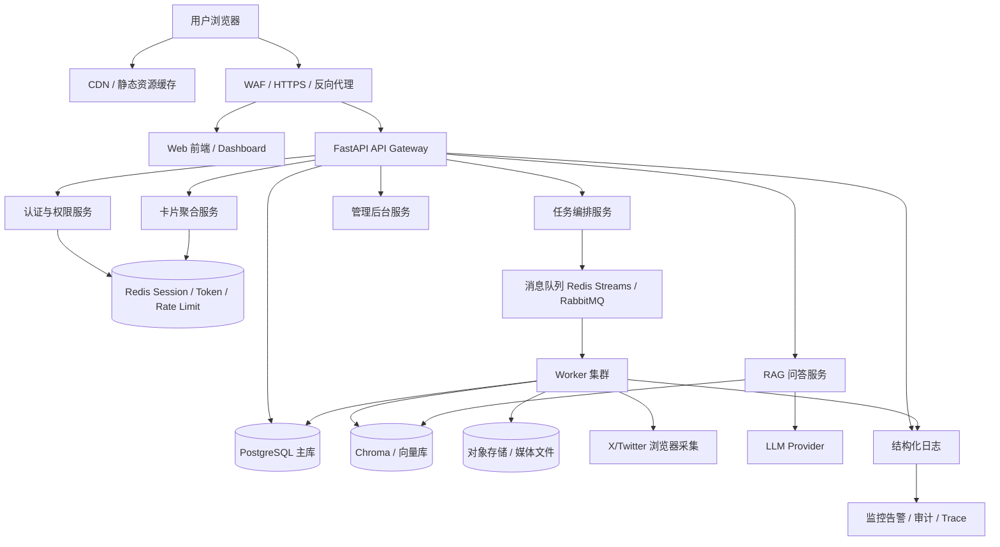
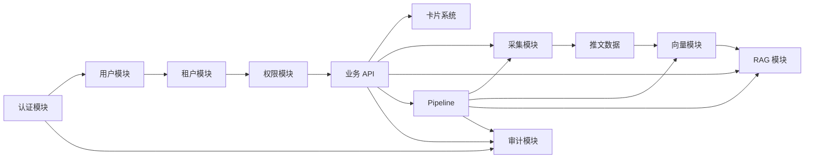
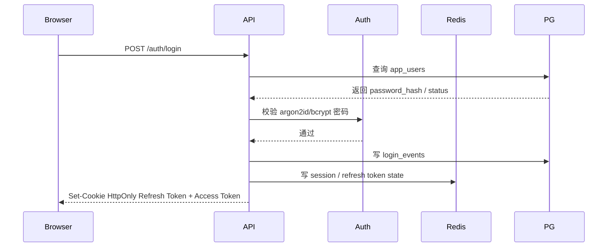
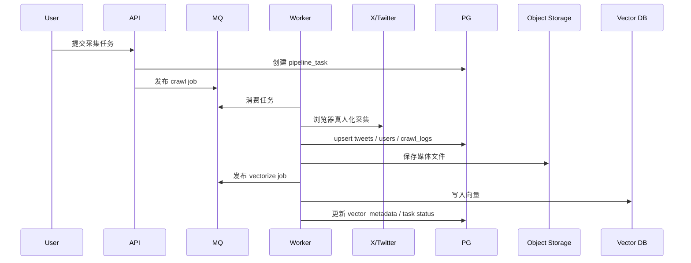

# 推特用户蒸馏项目生产级网站体系设计方案

> 面向未来多用户登录、高并发访问、可审计、可扩展生产环境的系统性架构设计。

**生成日期：** 2026-06-10
**适用项目：** 推特用户蒸馏 / Twitter Investor Distiller
**当前定位：** 从单用户本地投资研究控制台，演进为可支持多用户、多租户、生产部署的 AI 投资研究网站体系。

---

## 1. 执行摘要

当前项目已经具备较完整的单用户投资研究工作流：浏览器真人化采集 X/Twitter 内容，使用 SQLite 存储结构化数据，本地保存媒体文件，Chroma 存储向量，OpenAI/兼容模型提供 RAG 问答，并通过 FastAPI + Jinja2 模板提供 Web 控制台。

但从生产级多用户网站角度看，当前系统仍是典型的「单机、单用户、可信环境控制台」架构，暂不适合直接面向多用户或公网开放。主要短板包括：

- 缺少登录认证、会话管理、Token 刷新和密码哈希体系。
- 缺少管理员、操作员、观察者等角色权限控制。
- 现有数据库表没有 `tenant_id` / `owner_user_id`，不具备多用户数据隔离能力。
- 前端卡片缓存与 `sessionStorage` 没有按用户隔离，用户切换可能残留旧数据。
- 当前 SQLite + 进程内缓存 + 进程内限流不支持水平扩展。
- 日志以应用排错为主，缺少用户行为审计与异常行为追踪。
- Docker 部署仅包含一个 app 服务，缺少 PostgreSQL、Redis、任务队列、监控、反向代理等生产组件。

本方案建议采用「渐进式生产化改造」：先补齐安全边界和多用户底座，再迁移数据层与任务调度，最后完善高可用、监控、运维和成本治理。

---

## 2. 当前项目事实基线

### 2.1 当前技术栈

从 `requirements.txt` 与代码结构看，当前核心技术如下：

| 层级 | 当前技术 |
|---|---|
| Web 后端 | FastAPI, Uvicorn |
| 模板渲染 | Jinja2 / HTML 模板 |
| 前端交互 | 原生 JavaScript, fetch, 卡片式 DOM 注入 |
| ORM | SQLAlchemy 2.x |
| 默认数据库 | SQLite, `data/twitter_data.db` |
| 向量数据库 | ChromaDB |
| AI / RAG | OpenAI SDK, LangChain, sentence-transformers |
| 采集 | Playwright 浏览器真人化抓取 |
| 日志 | Loguru |
| 部署 | 单服务 Docker Compose |

### 2.2 当前主要入口

| 文件 | 作用 |
|---|---|
| `src/interfaces/web_api.py` | FastAPI Web 主入口，提供 dashboard、cards、pipeline 等接口 |
| `src/templates/base.html` | 仪表盘主模板，包含全局 JS 状态与卡片加载逻辑 |
| `src/storage/models.py` | SQLAlchemy ORM 模型定义 |
| `src/storage/database.py` | 数据库初始化与 session 管理 |
| `src/utils/logger.py` | Loguru 日志配置 |
| `docker-compose.yml` | 当前单 app 服务部署定义 |

### 2.3 当前核心数据表

当前 `src/storage/models.py` 定义了 6 个主要表：

| 表 | 当前含义 | 多用户问题 |
|---|---|---|
| `users` | 被监控的 Twitter 用户，不是网站登录用户 | 名称容易和系统用户混淆，无租户隔离 |
| `tweets` | 采集到的推文 | 无 `tenant_id`，不同用户数据可能混杂 |
| `media` | 推文媒体文件记录 | 本地文件路径无租户隔离 |
| `crawl_logs` | 采集日志 | 无操作人、租户、触发来源 |
| `vector_metadata` | 向量元数据 | 无租户过滤字段，RAG 可能串数据 |
| `pipeline_tasks` | 简易流水线任务队列 | 无创建人、租户、并发锁、优先级 |

### 2.4 当前前端状态

`src/templates/base.html` 中存在全局状态：

```javascript
var ALL_CARDS = [];
var TABS = [];
var TAB_CARDS = {};
var CARD_META = {};
var CACHE = {};
var LAST_FETCH = {};
var REFRESH_MAP = {};
```

并通过：

```javascript
sessionStorage.getItem('lastTab')
sessionStorage.setItem('lastTab', tabKey)
```

保存最后访问的标签页。当前没有用户维度缓存 key，未来登录/登出/切换账号时需要重构。

---

## 3. 目标生产架构

### 3.1 总体架构图



### 3.2 推荐生产组件

| 组件 | 推荐选型 | 作用 |
|---|---|---|
| 反向代理 | Nginx / Traefik / Caddy | HTTPS、压缩、路由、基础限流 |
| Web API | FastAPI + Uvicorn/Gunicorn | 业务 API 与页面服务 |
| 主数据库 | PostgreSQL | 多用户结构化数据、事务、审计 |
| 缓存 | Redis | Session、限流、卡片缓存、任务锁 |
| 消息队列 | Redis Streams / RabbitMQ | 异步任务解耦 |
| Worker | Celery / RQ / Dramatiq | 采集、向量化、LLM 分析、价格拉取 |
| 向量库 | Chroma 起步，后续可换 Qdrant / pgvector | RAG 检索 |
| 对象存储 | 本地 MinIO / 云对象存储 | 图片、视频、导出文件 |
| 日志 | Loguru + JSON 输出 | 应用日志与审计基础 |
| 监控 | Prometheus + Grafana | 指标、性能与告警 |
| 错误追踪 | Sentry / OpenTelemetry | 异常与链路追踪 |

---

## 4. 系统架构设计

### 4.1 分层架构

建议将系统拆为以下层级：

```text
Presentation Layer
  - Web Dashboard
  - Admin Console
  - Telegram Bot
  - Future API Clients

API Layer
  - Auth API
  - Card API
  - Pipeline API
  - RAG Chat API
  - Admin API

Domain Service Layer
  - User Service
  - Tenant Service
  - Permission Service
  - Crawl Service
  - Tweet Service
  - Vector Service
  - RAG Service
  - Portfolio / Insight Service
  - Audit Service

Infrastructure Layer
  - PostgreSQL
  - Redis
  - Message Queue
  - Chroma / Vector Store
  - Object Storage
  - LLM Provider
  - Browser Crawler Runtime
```

### 4.2 应用服务拆分策略

第一阶段不建议立刻拆微服务，建议采用「模块化单体 + 异步 Worker」：

```text
web-api service
  - FastAPI
  - 登录、权限、卡片、RAG、任务提交

worker service
  - 采集任务
  - 向量化任务
  - LLM 分析任务
  - 价格数据任务
  - 画像生成任务

scheduler service
  - 定时采集
  - 定时刷新指标
  - 过期会话清理
  - 审计日志归档
```

等到业务量明显增长后，再按边界拆分为独立服务：

- auth-service
- crawl-service
- rag-service
- analytics-service
- notification-service

### 4.3 高可用部署拓扑

生产部署建议至少具备：

```text
Load Balancer
  -> web-api-1
  -> web-api-2
  -> web-api-N

Redis Cluster / Redis Sentinel
PostgreSQL Primary + Read Replica
Worker Pool N replicas
Object Storage
Monitoring Stack
```

---

## 5. 功能模块拆解

### 5.1 模块清单

| 模块 | 主要职责 | 当前状态 | 目标状态 |
|---|---|---|---|
| 认证模块 | 登录、登出、刷新 Token、会话管理 | 缺失 | 必须新增 |
| 用户模块 | 系统用户、个人资料、密码管理 | 缺失 | 必须新增 |
| 租户模块 | 多用户/多工作区隔离 | 缺失 | 必须新增 |
| 权限模块 | RBAC、接口权限、页面权限 | 缺失 | 必须新增 |
| 采集目标模块 | 管理被跟踪 Twitter 用户 | 已有基础能力 | 加租户隔离和权限 |
| 推文数据模块 | 推文入库、查询、筛选 | 已有 | 加隔离、索引和分页 |
| 媒体模块 | 图片/视频保存与访问 | 已有 | 迁移对象存储和访问控制 |
| 向量模块 | 向量化、检索元数据 | 已有 | 按租户 collection/filter 隔离 |
| RAG 问答模块 | 语义检索 + LLM 回答 | 已有 | 加配额、审计、缓存 |
| 卡片系统 | Dashboard 卡片渲染 | 已有 | 加权限、用户缓存隔离 |
| Pipeline 模块 | 异步任务管理 | 已有简易队列 | 迁移 MQ + Worker |
| 通知模块 | Telegram 通知 | 已有配置 | 加密保存、按租户配置 |
| 审计模块 | 操作留痕与风险追踪 | 缺失 | 必须新增 |
| 管理后台 | 用户、角色、配置管理 | 缺失 | 必须新增 |
| 运维模块 | 健康检查、指标、告警 | 部分缺失 | 必须新增 |

### 5.2 模块依赖关系



---

## 6. 用户与权限体系

### 6.1 用户模型设计

由于当前 `users` 表已经表示「Twitter 监控用户」，建议新增网站登录用户表时不要继续使用 `users` 这个名称，而使用：

```text
app_users
```

推荐核心表：

```text
app_users
roles
permissions
role_permissions
tenants
tenant_members
user_sessions
refresh_tokens
login_events
audit_logs
```

### 6.2 用户注册与认证流程



### 6.3 Token 策略

| 类型 | 存储位置 | 有效期 | 说明 |
|---|---|---|---|
| Access Token | 前端内存或短期 Cookie | 15-30 分钟 | 用于 API 请求 |
| Refresh Token | HttpOnly Secure Cookie | 7-30 天 | 用于刷新登录态 |
| Session State | Redis | 同 Refresh Token | 支持踢下线和强制失效 |

要求：

- Refresh Token 必须可撤销。
- 登出时删除 Redis session 并使 refresh token 失效。
- 密码修改后强制所有旧 session 失效。
- 管理员可查看当前用户活跃设备并踢下线。

### 6.4 RBAC 角色设计

第一版建议角色如下：

| 角色 | 定位 | 权限范围 |
|---|---|---|
| `admin` | 系统/租户管理员 | 用户管理、角色管理、配置、所有业务操作 |
| `operator` | 运营/研究操作员 | 可运行采集、分析、画像、RAG，但不可改系统配置 |
| `viewer` | 只读观察者 | 查看卡片、查看分析结果、发起有限问答 |
| `guest` | 访客 | 仅可访问 landing 或演示页面 |

### 6.5 权限粒度

推荐使用权限码：

```text
dashboard.view
cards.read
cards.action
crawl.target.create
crawl.target.delete
pipeline.run
pipeline.cancel
script.run
telegram.config.update
rag.chat
rag.export
user.manage
role.manage
audit.view
system.config.update
```

后端必须强制校验，前端隐藏按钮只能作为体验优化，不能作为安全边界。

---

## 7. 数据架构设计

### 7.1 多租户隔离模型

建议采用「共享数据库 + 所有业务表强制 tenant_id」模式。

优点：

- 开发和运维复杂度可控。
- 适合当前项目从单用户向小规模多用户演进。
- 后续可将重点租户拆到独立库。

### 7.2 核心表改造

当前业务表建议增加：

| 表 | 新增字段 |
|---|---|
| `users` | `tenant_id`, `created_by`, `source_type` |
| `tweets` | `tenant_id`, `ingested_by`, `visibility` |
| `media` | `tenant_id`, `storage_backend`, `object_key` |
| `crawl_logs` | `tenant_id`, `triggered_by`, `request_id` |
| `vector_metadata` | `tenant_id`, `collection_name`, `embedding_model` |
| `pipeline_tasks` | `tenant_id`, `created_by`, `priority`, `locked_by`, `locked_at`, `retry_count` |

### 7.3 推荐新增表

#### `app_users`

```text
id
email
username
password_hash
status
last_login_at
created_at
updated_at
```

#### `tenants`

```text
id
name
slug
plan
status
created_at
updated_at
```

#### `tenant_members`

```text
id
tenant_id
user_id
role_id
status
joined_at
```

#### `audit_logs`

```text
id
tenant_id
user_id
action
resource_type
resource_id
ip_address
user_agent
request_id
status
risk_level
metadata
created_at
```

### 7.4 索引设计

必须增加的索引：

```text
users: tenant_id + username
tweets: tenant_id + tweet_id
tweets: tenant_id + user_id + created_at_twitter
tweets: tenant_id + created_at_twitter
media: tenant_id + tweet_id
vector_metadata: tenant_id + vector_id
pipeline_tasks: tenant_id + status + task_type
pipeline_tasks: tenant_id + created_by + created_at
audit_logs: tenant_id + user_id + created_at
audit_logs: tenant_id + action + created_at
```

唯一约束应从全局唯一改为租户内唯一：

```text
username unique -> tenant_id + username unique
tweet_id unique -> tenant_id + tweet_id unique
vector_id unique -> tenant_id + vector_id unique
```

### 7.5 数据一致性策略

| 场景 | 策略 |
|---|---|
| 推文入库 | 使用 upsert，按 `tenant_id + tweet_id` 幂等 |
| 媒体下载 | 先写 pending，下载成功后更新 object_key |
| 向量化 | 推文入库后异步任务处理，失败可重试 |
| RAG 检索 | 必须带 tenant filter |
| Pipeline | 任务状态机 + 乐观锁/分布式锁 |
| 审计日志 | 敏感操作与业务事务尽量同事务写入 |

---

## 8. 数据流转设计

### 8.1 采集数据流



### 8.2 RAG 问答数据流

```text
用户问题
  -> Auth 校验
  -> 权限与配额校验
  -> query rewrite / embedding
  -> Chroma 按 tenant_id 检索
  -> PostgreSQL 补充结构化上下文
  -> LLM 生成答案
  -> 写入 chat_logs / audit_logs
  -> 返回答案和引用来源
```

### 8.3 卡片渲染数据流

```text
浏览器请求 /cards/{name}
  -> current_user
  -> current_tenant
  -> require_permission(cards.read)
  -> Redis 查短缓存
  -> PostgreSQL / Chroma 聚合数据
  -> Jinja2 渲染 HTML
  -> 返回 {html, data, error}
```

---

## 9. 前端与状态管理设计

### 9.1 当前保留原则

项目已经制定了前端卡片规则：

- 卡片 API 返回 `{html, data, error}`。
- Template 和 `_render_html()` 互斥。
- 禁止 Python 生成 `onclick`，统一 `data-action` + 事件委托。
- 所有请求走统一 `apiFetch()`。
- 卡片数据使用 dataclass schema 校验。
- DOM ID 以卡片名为前缀。
- 每个卡片槽位实现加载中、失败、空数据三态。

生产化改造应继续遵守这些规则。

### 9.2 多用户前端状态隔离

必须改造：

```javascript
CACHE[c.name]
LAST_FETCH[c.name]
sessionStorage.getItem('lastTab')
```

为用户/租户隔离：

```javascript
const scopeKey = currentTenant.id + ':' + currentUser.id;
const cacheKey = scopeKey + ':' + cardName;
const tabKey = 'lastTab:' + scopeKey;
```

登出时必须：

```javascript
CACHE = {};
LAST_FETCH = {};
sessionStorage.clear();
```

### 9.3 前端权限控制

`/cards/meta` 返回卡片元数据时，应根据用户权限过滤：

```json
{
  "name": "script_runner",
  "permissions": ["script.run"],
  "visible": false
}
```

注意：前端隐藏只是体验，后端 action 仍必须校验权限。

---

## 10. 安全体系设计

### 10.1 安全边界

| 层级 | 措施 |
|---|---|
| 网络层 | HTTPS, HSTS, WAF, IP 黑白名单 |
| 接入层 | Nginx 限流、请求大小限制、上传限制 |
| 应用层 | Auth, RBAC, CSRF, CORS 白名单 |
| 数据层 | tenant_id 强制过滤、敏感字段加密 |
| 任务层 | 脚本白名单、任务权限、分布式锁 |
| AI 层 | Prompt 注入防护、引用来源、成本限流 |
| 审计层 | 登录、敏感操作、异常行为全记录 |

### 10.2 接口安全

必须实施：

- 所有 `/dashboard`、`/cards/*`、`/pipeline/*`、`/chat` 接口加 `current_user`。
- 所有 POST/PUT/DELETE 加权限校验。
- 表单或 Cookie 登录场景增加 CSRF 防护。
- 所有输入使用 Pydantic schema，而不是裸 `dict`。
- 对高危接口增加二次确认或重新认证。
- 禁止任意脚本名执行，`script_runner` 必须白名单化。

### 10.3 敏感信息保护

敏感信息包括：

- X/Twitter cookies
- Telegram bot token
- OpenAI / LLM API key
- 数据库密码
- Redis 密码
- 用户 refresh token

策略：

- 不在前端返回完整 token。
- 数据库存储前加密或只存密文引用。
- 日志中自动脱敏。
- `.env` 不进入版本控制。
- 生产环境使用 Secret Manager 或容器平台 Secret。

### 10.4 防攻击策略

| 攻击类型 | 防护 |
|---|---|
| 暴力破解 | 登录失败计数、验证码、IP + username 限流 |
| CSRF | SameSite Cookie + CSRF Token |
| XSS | Jinja2 自动转义、禁止任意 HTML、CSP |
| SSRF | 外部 URL 白名单，禁止内网地址访问 |
| 越权访问 | 后端 RBAC + tenant_id 强制过滤 |
| 任务滥用 | 用户级并发限制、任务配额 |
| LLM 成本攻击 | Token 配额、频率限制、预算告警 |
| Prompt Injection | 系统提示隔离、工具权限最小化、来源引用 |

---

## 11. 性能与扩展性设计

### 11.1 瓶颈判断

当前主要瓶颈：

| 瓶颈 | 当前原因 | 改造方向 |
|---|---|---|
| 数据库写入 | SQLite 单机文件库 | PostgreSQL |
| 限流 | 进程内 `_rate_buckets` | Redis 限流 |
| 卡片加载 | 每次请求可能查库/渲染 | Redis 短缓存 |
| 长任务 | Web 进程内触发 | MQ + Worker |
| 媒体存储 | 本地文件 | 对象存储 |
| RAG 检索 | 单 collection 风险 | tenant filter / 多 collection |
| LLM 调用 | 成本和延迟 | 缓存、队列、配额 |

### 11.2 缓存策略

| 数据 | 缓存位置 | TTL |
|---|---|---|
| `/cards/meta` | Redis / 浏览器 | 5-30 分钟 |
| 普通统计卡片 | Redis | 5-60 秒 |
| 高成本分析卡片 | Redis | 5-30 分钟 |
| 用户权限 | Redis | 1-5 分钟 |
| Session | Redis | 7-30 天 |
| RAG 查询结果 | Redis | 1-24 小时，按问题 hash |

### 11.3 水平扩展原则

Web API 必须无状态化：

- 不在进程内保存登录状态。
- 不依赖进程内任务状态。
- 不依赖本地文件作为唯一数据源。
- 所有共享状态放 PostgreSQL / Redis / Object Storage。

Worker 可水平扩展：

- 任务通过 MQ 分发。
- 使用分布式锁避免同一采集目标重复执行。
- 每个租户设置并发上限。
- 高成本 LLM 任务单独队列。

---

## 12. 运维部署设计

### 12.1 生产 Docker Compose 基线

建议生产化后至少包含：

```text
services:
  reverse-proxy
  web-api
  worker
  scheduler
  postgres
  redis
  chroma
  object-storage
  prometheus
  grafana
```

### 12.2 环境划分

| 环境 | 用途 |
|---|---|
| local | 本地开发，SQLite 可保留 |
| staging | 预发布，使用 PostgreSQL + Redis |
| production | 生产，多副本、高可用、监控告警 |

### 12.3 数据迁移

必须引入：

```text
Alembic
```

原因：当前 `Base.metadata.create_all()` 只适合开发初始化，不适合生产 schema 演进。

### 12.4 健康检查

新增接口：

```text
GET /healthz        # 进程是否存活
GET /readyz         # 数据库、Redis、向量库是否可用
GET /metrics        # Prometheus 指标
```

### 12.5 备份与恢复

| 对象 | 策略 |
|---|---|
| PostgreSQL | 每日全量 + WAL 归档 |
| Redis | 根据用途决定是否持久化，Session 可不强依赖 |
| 对象存储 | 版本控制 + 生命周期管理 |
| Chroma / 向量库 | 定期快照，可从 PostgreSQL 重建 |
| 配置 Secret | 密钥管理服务备份 |

---

## 13. 日志、监控与审计

### 13.1 日志分类

| 类型 | 内容 |
|---|---|
| 应用日志 | 请求处理、任务状态、错误堆栈 |
| 审计日志 | 谁在什么时候做了什么 |
| 安全日志 | 登录失败、越权访问、限流命中 |
| 任务日志 | 采集、向量化、LLM 调用、重试 |
| 成本日志 | LLM token、API 调用次数、任务耗时 |

### 13.2 关键指标

| 指标 | 说明 |
|---|---|
| `http_requests_total` | 请求总数 |
| `http_request_duration_seconds` | API 延迟 |
| `auth_login_failures_total` | 登录失败次数 |
| `rate_limit_hits_total` | 限流命中 |
| `pipeline_tasks_pending` | 待处理任务数 |
| `pipeline_task_duration_seconds` | 任务耗时 |
| `crawler_success_rate` | 采集成功率 |
| `rag_query_duration_seconds` | RAG 延迟 |
| `llm_tokens_total` | LLM token 消耗 |
| `tenant_quota_usage` | 租户配额使用率 |

### 13.3 告警规则

| 告警 | 条件 |
|---|---|
| 登录暴力破解 | 同 IP 或用户 5 分钟失败超过阈值 |
| API 错误率高 | 5xx 超过 1%-5% |
| 任务积压 | pending 任务持续增长 |
| 采集失败率高 | 连续多次 X/Twitter 采集失败 |
| LLM 成本异常 | 单租户 token 消耗突增 |
| 数据库连接异常 | readyz 失败或连接池耗尽 |
| Redis 不可用 | session / rate limit 失败 |

---

## 14. 交付标准

### 14.1 架构交付物

| 交付物 | 说明 |
|---|---|
| 生产架构设计文档 | 本文档 |
| 数据库 ERD | app_users、tenants、业务表、audit_logs 关系图 |
| 权限矩阵 | 页面、接口、按钮、角色权限 |
| API 安全规范 | Auth、RBAC、CSRF、限流、错误格式 |
| 数据迁移方案 | SQLite 到 PostgreSQL，Alembic 管理 |
| 部署手册 | Docker Compose / 云部署 / 回滚 |
| 监控面板 | Grafana dashboard |
| 应急预案 | 数据恢复、服务降级、密钥泄露处理 |

### 14.2 工程交付标准

每个阶段必须满足：

- 有数据库迁移脚本。
- 有单元测试和至少关键接口集成测试。
- 有安全回归测试。
- 有审计日志验证。
- 有 staging 环境验证记录。
- 有回滚方案。
- 不破坏现有单用户本地使用路径。

---

## 15. 优先级路线图

### P0：安全封口，避免裸奔

目标：网站即使部署出来，也不能被未授权访问。

必须完成：

1. 新增 `app_users` 表。
2. 增加密码哈希，使用 argon2id 或 bcrypt。
3. 新增登录、登出、刷新 Token 接口。
4. `/dashboard`、`/cards/*`、`/pipeline/*` 全部加 `current_user`。
5. `/cards/{name}/action` 加权限校验。
6. `script_runner` 默认仅 admin 可用，并改为脚本白名单。
7. Telegram token、X cookies 等敏感配置不再明文暴露。

### P1：多用户和租户隔离

目标：不同用户的数据不会互相污染。

必须完成：

1. 新增 `tenants`、`tenant_members`、`roles`、`permissions`。
2. 业务表增加 `tenant_id`。
3. 所有查询强制带 `tenant_id`。
4. Chroma 检索增加 tenant filter 或按租户 collection。
5. 媒体文件路径改为按租户分区。
6. 前端缓存 key 加用户/租户维度。
7. 登出和切换租户清空前端状态。

### P2：任务系统生产化

目标：长任务不阻塞 Web，支持重试和并发控制。

必须完成：

1. 引入 Redis。
2. 引入 Celery / RQ / Dramatiq。
3. 采集、向量化、画像、RAG 高成本任务全部迁移到 Worker。
4. 增加任务锁、重试次数、失败原因、任务取消。
5. 按租户限制并发数和任务队列长度。

### P3：数据库与部署生产化

目标：支持高并发和水平扩展。

必须完成：

1. 从 SQLite 迁移 PostgreSQL。
2. 引入 Alembic。
3. 增加 Redis session 和 Redis 限流。
4. Docker Compose 增加 PostgreSQL、Redis、Worker、Scheduler。
5. 增加 `/healthz`、`/readyz`、`/metrics`。

### P4：审计、监控和成本治理

目标：可观测、可追踪、可控成本。

必须完成：

1. 新增 `audit_logs`。
2. 所有敏感操作写审计。
3. 增加结构化 JSON 日志。
4. 增加 Prometheus 指标。
5. 增加 Grafana dashboard。
6. 增加 LLM token 成本统计和租户配额。
7. 增加异常行为告警。

---

## 16. 推荐第一阶段实施清单

如果下一步要进入开发，建议先做「最小多用户安全闭环」，不要一次性改完整生产架构。

第一阶段建议任务：

1. 新建 `src/auth/` 模块。
2. 新建 `AppUser`、`Role`、`UserSession` 模型。
3. 添加 Alembic 或至少先添加可重复执行的迁移脚本。
4. 增加密码哈希工具。
5. 增加登录页模板。
6. 增加 `/auth/login`、`/auth/logout`、`/auth/me`。
7. 增加 `get_current_user()` 依赖。
8. 保护 `/dashboard`。
9. 保护 `/cards/meta` 与 `/cards/{name}`。
10. 保护 `/cards/{name}/action`，并先实现 admin/operator/viewer 三类角色。
11. 前端 `apiFetch()` 增加 401 跳登录。
12. 登出时清空 `CACHE`、`LAST_FETCH`、`sessionStorage`。
13. 给 `script_runner`、`telegram`、`daemon` 加 admin-only。
14. 增加登录失败和敏感操作审计日志。

完成以上内容后，当前网站才具备继续做多用户数据隔离和生产部署的基础。

---

## 17. 结论

当前项目的产品雏形和研究链路已经比较清晰，但生产级多用户网站的关键不在于继续增加卡片，而在于补齐「身份、权限、隔离、任务、审计、运维」六个底座。

最推荐的演进路线是：

```text
单用户控制台
  -> 加登录认证
  -> 加 RBAC
  -> 加 tenant_id 数据隔离
  -> SQLite 迁 PostgreSQL
  -> Redis Session / Cache / Rate Limit
  -> MQ + Worker
  -> 审计日志和监控告警
  -> 水平扩展和高可用
```

短期目标应该是先做到：

> 登录后才能访问，角色决定能做什么，所有数据都有明确归属，所有敏感操作都可审计。

这一步完成后，再讨论大规模高并发和完整生产运维，才是稳妥路线。
