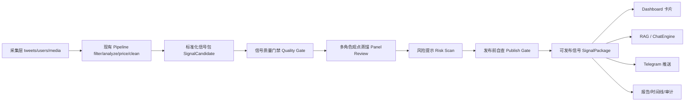

# Signal Governance Architecture Implementation Plan

> **For Claude:** REQUIRED SUB-SKILL: Use superpowers:executing-plans to implement this plan task-by-task.

**Goal:** 将 UZI-Skill 中最值得借鉴的信号质量门禁、多角色观点蒸馏、风险提示、发布前自查四类能力，完整设计为 Twitter Investor Distiller 的「信号治理层」，并与现有采集、Pipeline、Dashboard、RAG 系统对接。

**Architecture:** 不做一次性轻量卡片，也不把 UZI-Skill 直接复制进项目。目标是新增一层可长期扩展的 `Signal Governance Layer`：上接现有 X/Twitter 采集与分析结果，下接共识信号、智能问答、Dashboard 和 Telegram 推送；所有 AI 结论必须经过质量门禁、角色评审、风险扫描和发布前自查，最终形成可追溯、可解释、可回放的信号包。

**Tech Stack:** Python 3.13、FastAPI、SQLAlchemy/SQLite、Chroma、Jinja2 卡片系统、原生 JavaScript、OpenAI-compatible LLM (`LLM_BASE_URL + LLM_API_KEY + CHAT_MODEL`)、pytest、现有 `PipelineTask` 单线程执行器。

---

## 1. 背景与判断

### 1.1 为什么不能做轻量版

本项目不是普通 Demo，而是一个长期自用的投资研究系统。四个方向如果只做轻量版，会产生以下结构性问题：

1. **质量门禁轻量化会变成几个 if 判断**，后续难以支持数据源可信度、时间窗口、证据覆盖、数据缺口等复杂规则。
2. **多角色评审轻量化会变成 prompt 拼接**，后续很难沉淀角色规则、评分标准、反驳关系和历史表现。
3. **风险提示轻量化会变成关键词扫描**，后续无法扩展到传播集中度、话术相似度、来源可靠性和 K 线异常联动。
4. **发布前自查轻量化会变成页面展示前的临时校验**，后续不能形成统一的发布 gate、审计日志和错误阻断机制。

因此，本方案将四个方向设计为完整的横向架构层，而不是单卡片、单脚本或一次性功能。

### 1.2 UZI-Skill 的可借鉴点

对 `wbh604/UZI-Skill` 的评估结论：高参考价值，但不建议直接安装或照搬。

最值得吸收的是：

- `collect → score → synthesize → render` 分阶段投研 pipeline。
- `raw_data / dimensions / panel / agent_analysis / synthesis` 中间产物落盘。
- 数据缺口显式记录，不用默认值糊弄。
- `self_review` 发布前 gate，critical 不过则阻止报告生成。
- 投资人/流派评审团，把观点解释与评分标准结构化。
- `trap-detector` 的 8 类风险信号与风险等级输出。
- 结论必须绑定证据来源的反幻觉机制。

### 1.3 与现有系统的关系

现有系统已经具备主干能力：

- 采集层：`src/crawler/*`、SQLite `tweets/users/media/crawl_logs`。
- 处理层：`src/pipeline/task_executor.py`，任务类型包括 `filter/analyze/fetch_price/fetch_crypto/portrait/clean`。
- 信号层：`scripts/compute_signals.py`、`scripts/compute_consensus.py`、`scripts/compute_rotation.py`。
- 展示层：`src/cards/*`、`src/templates/base.html`、`/cards/meta`、`/cards/{name}`。
- RAG 层：`src/ai/chat_engine.py`、`src/vectorization/*`、Chroma。
- LLM 配置：已改为通用 OpenAI-compatible 的 `LLM_BASE_URL + LLM_API_KEY + CHAT_MODEL`。

新增架构不应替换这些模块，而应插入在「分析结果 → 信号展示/问答/推送」之间。

---

## 2. 总体目标架构

### 2.1 新增横向层：Signal Governance Layer



### 2.2 四大能力的分工

| 模块 | 位置 | 目标 | 输出 | 是否阻断发布 |
|---|---|---|---|---|
| 信号质量门禁 | Pipeline 后、评审前 | 判断数据是否足够可信、完整、新鲜 | `QualityAssessment` | 是，critical 可阻断 |
| 多角色观点蒸馏 | 质量门禁后 | 用不同投资框架解释同一信号 | `PanelReview` | 否，但低共识会降权 |
| 风险提示模块 | 评审后、发布前 | 扫描异常推广、杀猪盘、话术诱导、来源风险 | `RiskAssessment` | 是，高风险可阻断或降级 |
| 报告发布前自查 | 最后一关 | 检查证据、引用、字段、结论一致性 | `PublishReview` | 是，critical 阻断 |

### 2.3 核心设计原则

1. **先结构化，再 AI 解释。** 规则、数据缺口、证据引用先落结构化字段，LLM 只负责解释和综合。
2. **所有结论必须可追溯。** 任何信号、评分、风险提示必须能回到 tweet_id、source_url、价格数据或明确标注为推断。
3. **所有 gate 都要输出机器可读结果。** 前端展示只是结果消费者，不能把业务规则写在模板里。
4. **不要把四个方向做成四个孤岛。** 它们共享 `SignalCandidate`、`EvidenceRef`、`DataGap`、`GovernanceRun`。
5. **与现有任务队列兼容。** 继续使用 `PipelineTask` 的串行执行模型，避免并发写 SQLite/JSON 和 LLM 频率问题。

---

## 3. 目标数据模型

### 3.1 核心实体

建议新增文件：`src/governance/models.py`。

```python
from __future__ import annotations

from dataclasses import dataclass, field
from datetime import datetime
from typing import Literal

Severity = Literal["info", "warning", "critical"]
GateStatus = Literal["pass", "warn", "block", "unknown"]
RiskLevel = Literal["safe", "notice", "caution", "high_risk", "unknown"]
PanelStance = Literal["bullish", "bearish", "neutral", "avoid", "insufficient_data"]


@dataclass(frozen=True)
class EvidenceRef:
    source_type: Literal["tweet", "price", "analysis", "consensus", "search", "manual"]
    source_id: str
    url: str | None = None
    title: str | None = None
    excerpt: str | None = None
    timestamp: str | None = None
    reliability: float | None = None


@dataclass(frozen=True)
class DataGap:
    code: str
    message: str
    severity: Severity
    required_for_publish: bool = False


@dataclass
class SignalCandidate:
    signal_id: str
    ticker: str
    asset_name: str | None
    generated_at: datetime
    source_tweet_ids: list[str]
    source_usernames: list[str]
    stance: str | None
    signal_score: float | None
    confidence: str | None
    consensus_score: float | None = None
    evidence: list[EvidenceRef] = field(default_factory=list)
    data_gaps: list[DataGap] = field(default_factory=list)
    raw_payload: dict = field(default_factory=dict)
```

### 3.2 四类评估结果

```python
@dataclass
class QualityAssessment:
    signal_id: str
    status: GateStatus
    score: float
    checks: list[dict]
    data_gaps: list[DataGap]
    evidence: list[EvidenceRef]
    summary: str


@dataclass
class PanelReview:
    signal_id: str
    panel_version: str
    reviewers: list[dict]
    consensus: dict
    conflicts: list[dict]
    summary: str


@dataclass
class RiskAssessment:
    signal_id: str
    level: RiskLevel
    score: float
    signals_hit: list[dict]
    user_keyword_boost: int
    recommendation: str
    evidence: list[EvidenceRef]


@dataclass
class PublishReview:
    signal_id: str
    status: GateStatus
    checks: list[dict]
    blocked_reasons: list[str]
    warnings: list[str]
    published_at: datetime | None = None
```

### 3.3 持久化策略

短期使用 SQLite + JSON 双轨，避免一次性大迁移：

1. **SQLite 表用于索引和状态查询**。
2. **JSON 文件用于可回放的完整评估结果**。
3. **后续如果生产化，再迁移 JSON 内容到结构化表。**

建议新增 SQLite 表：

```python
class GovernanceRun(Base):
    __tablename__ = "governance_runs"

    id = Column(Integer, primary_key=True)
    run_id = Column(String(100), unique=True, nullable=False, index=True)
    signal_id = Column(String(100), nullable=False, index=True)
    ticker = Column(String(50), index=True)
    stage = Column(String(50), nullable=False)  # quality/panel/risk/publish
    status = Column(String(20), nullable=False) # pass/warn/block/failed
    score = Column(Float)
    result_path = Column(String(500))
    error_msg = Column(Text)
    created_at = Column(DateTime, default=datetime.now)
```

建议文件目录：

```text
data/governance/
  candidates/YYYY-MM-DD/{signal_id}.json
  quality/YYYY-MM-DD/{signal_id}.json
  panel/YYYY-MM-DD/{signal_id}.json
  risk/YYYY-MM-DD/{signal_id}.json
  publish/YYYY-MM-DD/{signal_id}.json
  packages/YYYY-MM-DD/{signal_id}.json
  runs/{run_id}.json
```

---

## 4. 模块一：信号质量门禁

### 4.1 目标

在任何信号进入 Dashboard、RAG 或推送前，先判断它是否具备足够的数据质量。

它回答的问题：

- 数据新鲜吗？
- 证据够吗？
- 标的识别可靠吗？
- 价格/行情是否缺失？
- 分析师历史表现是否可用？
- 这个信号是否只是单条孤立观点？

### 4.2 检查维度

| 检查项 | 输入 | 规则 | 输出 |
|---|---|---|---|
| 证据覆盖 | tweet_id、url、analysis | 至少 1 条原始 tweet 证据 | `missing_evidence` |
| 时间新鲜度 | tweet.created_at、analysis time | 默认 30 天内有效，可配置 | `stale_signal` |
| 标的识别 | `stock_details`、`stock_alias.csv` | ticker 不能为空，别名需能映射 | `ticker_unresolved` |
| 分析完整度 | stance/confidence/mentioned_stocks | 核心字段缺失则 warn/block | `analysis_incomplete` |
| 行情可用性 | `data/prices.json` | 股票信号应有价格上下文 | `price_missing` |
| 来源质量 | user profile、历史胜率 | 新账号/无胜率降权不阻断 | `source_unproven` |
| 多源确认 | consensus/analyzer count | 多人覆盖加分，单人不阻断 | `single_source` |
| 数据缺口 | 上游任务状态 | failed/pending 任务显式记录 | `upstream_gap` |

### 4.3 接入现有系统

新增模块：

```text
src/governance/
  __init__.py
  models.py
  candidate_builder.py
  quality_gate.py
  repository.py
```

对接点：

- 从 `data/pipeline/*_analyzed_cleaned.json` 构建 `SignalCandidate`。
- 从 SQLite `tweets/users` 补证据、URL、作者、发布时间。
- 从 `data/consensus/*_consensus.json` 补 `consensus_score`。
- 从 `data/prices.json` 补价格可用性。
- 从 `data/accuracy/*_accuracy.json` 补分析师历史胜率。

### 4.4 PipelineTask 任务类型

在 `src/pipeline/task_executor.py` 中新增任务类型：

```text
governance_quality
```

payload：

```json
{
  "signal_ids": ["NVDA-2026-06-10-TJ_Research-123"],
  "mode": "incremental"
}
```

返回：

```json
{
  "ok": true,
  "checked": 12,
  "passed": 8,
  "warned": 3,
  "blocked": 1
}
```

### 4.5 Dashboard 卡片

新增卡片：`quality_gate`。

位置：`数据管理` 或 `今日信号` 顶部状态条。

显示内容：

- 今日候选信号数。
- 通过 / 警告 / 阻断数量。
- Top 阻断原因。
- 数据缺口列表。
- 一键进入处理队列修复上游任务。

---

## 5. 模块二：多角色观点蒸馏

### 5.1 目标

把一个信号从“单一 AI 分析”升级为“多投资框架评审”。这不是娱乐化角色扮演，而是结构化专家系统：不同角色用不同标准评估同一信号，并输出可比较的评分、分歧和结论。

### 5.2 角色体系设计

不建议直接复制 UZI-Skill 的 66 位评委。建议建立可扩展角色层级：

```text
Panel Group
  ├── value_quality      价值/质量
  ├── growth_tech        成长/科技
  ├── macro_liquidity    宏观/流动性
  ├── trend_momentum     趋势/技术
  ├── china_hot_money    游资/情绪
  ├── risk_control       风控/反方
  └── source_forensics   信源可信度
```

每个角色不是一个 prompt，而是一份配置：

```yaml
id: china_hot_money
name: 游资情绪派
objective: 判断该信号是否具备短线情绪扩散、题材载体和资金接力可能
inputs_required:
  - ticker
  - tweet_text
  - stance
  - signal_score
  - price_context
  - social_spread_context
score_dimensions:
  - name: narrative_strength
    weight: 0.25
  - name: timing
    weight: 0.25
  - name: liquidity
    weight: 0.20
  - name: crowding_risk
    weight: 0.20
  - name: evidence_quality
    weight: 0.10
output_schema:
  stance: bullish|bearish|neutral|avoid|insufficient_data
  score: 0-100
  thesis: string
  key_evidence: list
  objections: list
  missing_data: list
```

建议配置目录：

```text
src/governance/panels/
  panel_registry.py
  schemas.py
  configs/
    value_quality.yaml
    growth_tech.yaml
    macro_liquidity.yaml
    trend_momentum.yaml
    china_hot_money.yaml
    risk_control.yaml
    source_forensics.yaml
```

### 5.3 LLM 调用策略

不要每个角色都独立无约束调用。采用两阶段：

1. **规则预评分**：用结构化数据先算每个角色可见的基础分。
2. **LLM 解释与冲突分析**：LLM 只基于结构化上下文和证据生成 `thesis/objections/missing_data`。

这样可以降低 hallucination 和成本。

### 5.4 输出结构

```json
{
  "signal_id": "NVDA-2026-06-10-TJ_Research-123",
  "panel_version": "2026-06-v1",
  "reviewers": [
    {
      "id": "growth_tech",
      "name": "成长科技派",
      "stance": "bullish",
      "score": 82,
      "thesis": "...",
      "key_evidence": ["tweet:123", "price:NVDA:2026-06-10"],
      "objections": ["估值分位未接入，需补充"],
      "missing_data": []
    }
  ],
  "consensus": {
    "avg_score": 71,
    "dispersion": 18,
    "final_stance": "bullish_with_risk",
    "agreement_level": "medium"
  },
  "conflicts": [
    {
      "between": ["growth_tech", "risk_control"],
      "reason": "增长叙事强，但证据集中在单一信源"
    }
  ]
}
```

### 5.5 接入点

新增任务类型：

```text
governance_panel
```

前置依赖：`quality_gate.status != block`。

输出写入：`data/governance/panel/YYYY-MM-DD/{signal_id}.json`。

新增 Dashboard 卡片：`panel_review`。

位置：`深度研究` 或 `投资决策`。

功能：

- 对某个 ticker 展示各角色评分雷达/表格。
- 展示主要分歧。
- 展示最终综合 stance。
- 支持从共识标的卡片点击进入。

### 5.6 RAG 对接

`ChatEngine` 回答问题时，应优先检索 `SignalPackage` 和 `PanelReview`，而不仅是 tweet chunk。

新增检索源：

```text
Chroma collection: signal_packages
metadata:
  signal_id
  ticker
  date
  reviewers
  risk_level
  publish_status
```

---

## 6. 模块三：风险提示模块

### 6.1 目标

在信号发布前扫描“异常推广 / 群荐股 / 杀猪盘 / 话术诱导 / 伪消息 / 热度基本面脱节”等风险。

重要边界：系统不应直接断言“这是杀猪盘”，而应表达为：

- 存在疑似异常推广风险。
- 出现多项高风险信号。
- 建议谨慎核实信息来源。

### 6.2 风险信号维度

借鉴 UZI-Skill `trap-detector`，但扩展成可加权规则系统：

| ID | 信号 | 权重 | 数据源 | 阻断等级 |
|---|---|---:|---|---|
| low_quality_promotion | 大量低质量账号同时推荐 | 15 | 搜索/社媒结果 | warn |
| template_language | 推荐话术模板化 | 15 | tweet/search text | warn |
| paid_group_funnel | VIP/微信群/老师引流 | 25 | 搜索/用户输入 | block 可选 |
| fundamentals_heat_gap | 基本面与热度脱节 | 15 | 财务/价格/热度 | warn |
| price_ramp_before_promo | 推荐前已大幅拉升 | 20 | K 线 | warn/block |
| guru_persona | 老师/股神人设推广 | 10 | 搜索/用户输入 | warn |
| cross_platform_push | 跨平台联动推广 | 20 | 搜索/热榜 | warn/block |
| fake_news_rumor | 谣言/辟谣/虚假消息 | 30 | 搜索/公告 | block |
| source_crowding | 信号来源过度集中 | 10 | tweets/users | warn |
| evidence_weakness | 证据弱或不可追溯 | 20 | quality gate | block 可选 |

### 6.3 风险等级

```text
0-19   safe       未见明显异常推广风险
20-39  notice     有少量风险迹象，需核实
40-69  caution    多项风险信号，建议谨慎
70+    high_risk  高风险，默认不进入强推送
```

### 6.4 输入来源

短期可用：

- 用户问题文本：识别“朋友推荐 / 群里老师 / 必涨 / 翻倍 / 内幕”等高风险触发词。
- 本地 tweets：检查信源集中度、话术相似度、异常观点变化。
- `data/prices.json`：检查推荐前拉升。
- `QualityAssessment`：证据缺口和来源可靠性。

中期可加：

- 多搜索引擎结果。
- 公告/财报/新闻。
- 社媒平台热度。
- 东方财富/同花顺/雪球讨论热度。

### 6.5 输出结构

```json
{
  "signal_id": "...",
  "ticker": "NVDA",
  "risk_score": 42,
  "risk_level": "caution",
  "signals_hit": [
    {
      "id": "source_crowding",
      "name": "信号来源过度集中",
      "severity": "warning",
      "score": 10,
      "evidence": ["tweet:123", "tweet:456"],
      "explanation": "近 7 天主要证据来自同一账号，缺少交叉验证"
    }
  ],
  "recommendation": "建议谨慎核实信息来源，不作为单独买入依据。"
}
```

### 6.6 接入点

新增任务类型：

```text
governance_risk
```

新增卡片：`risk_alerts`。

位置：`今日信号`，紧跟 `anomaly` 后。

展示：

- 今日高风险信号数。
- 风险等级分布。
- Top 风险标的。
- 点击展开证据和风险命中项。

智能问答接入：

当用户问“这只票靠谱吗 / 是不是杀猪盘 / 群里老师推荐能不能买”时，ChatEngine 应优先调用风险评估结果，而不是普通 RAG 直接回答。

---

## 7. 模块四：报告发布前自查

### 7.1 目标

任何进入 Dashboard 的“高亮信号”、任何 Telegram 推送、任何 AI 生成报告，都必须经过发布前自查。

它不是 UI 校验，而是最终发布 gate。

### 7.2 自查规则

| 检查 | 规则 | 失败级别 |
|---|---|---|
| evidence_required | 至少 1 条原始 tweet 或可信来源证据 | critical |
| no_unbacked_claim | 结论中的 ticker/stance/score 必须来自结构化字段 | critical |
| source_links_valid | 证据 URL 或 tweet_id 可追溯 | warning/critical |
| quality_not_blocked | QualityAssessment 不能是 block | critical |
| risk_not_high | high_risk 默认不能强推送 | critical |
| panel_conflict_disclosed | 多角色分歧较高时必须显示分歧 | warning |
| data_gap_visible | required data gap 必须展示给用户 | critical |
| stale_data_visible | 数据过期必须显式提示 | warning |
| disclaimer_present | 投资建议免责声明存在 | warning |
| model_config_visible | 记录使用的 CHAT_MODEL 和 base_url host | info |

### 7.3 发布对象

发布前自查适用于三类对象：

1. **Dashboard 信号包**：共识标的、风险提醒、多角色评审。
2. **Telegram 推送**：高风险或证据不足时不推送，或降级为“待核实提醒”。
3. **AI 报告/RAG 回答**：回答中涉及明确结论时附证据和风险提示。

### 7.4 输出结构

```json
{
  "signal_id": "...",
  "status": "warn",
  "checks": [
    {
      "id": "evidence_required",
      "status": "pass",
      "message": "已绑定 3 条原始 tweet 证据"
    },
    {
      "id": "panel_conflict_disclosed",
      "status": "warn",
      "message": "成长派与风控派分歧较高，前端必须显示分歧"
    }
  ],
  "blocked_reasons": [],
  "warnings": ["多角色分歧较高"]
}
```

### 7.5 接入点

新增任务类型：

```text
governance_publish
```

新增统一服务：

```text
src/governance/publish_gate.py
```

所有消费者只读取通过 publish gate 的 `SignalPackage`：

```text
data/governance/packages/YYYY-MM-DD/{signal_id}.json
```

---

## 8. 统一 SignalPackage

### 8.1 为什么需要 SignalPackage

当前系统有多个输出源：

- `data/pipeline/*_analyzed_cleaned.json`
- `data/consensus/*_consensus.json`
- `data/anomaly/*_anomaly.json`
- `data/rotation/*`
- Chroma tweet chunks

这些可以展示，但缺少统一发布对象。新增 `SignalPackage` 作为四大模块处理后的最终对象。

### 8.2 结构

```json
{
  "signal_id": "NVDA-2026-06-10-TJ_Research-123",
  "ticker": "NVDA",
  "asset_name": "NVIDIA",
  "generated_at": "2026-06-10T12:00:00",
  "summary": "多位分析师近期持续讨论 NVDA AI 算力需求，但风险控制角色提示估值和拥挤度风险。",
  "stance": "bullish_with_risk",
  "scores": {
    "signal_score": 78,
    "quality_score": 84,
    "panel_score": 71,
    "risk_score": 32,
    "publish_status": "warn"
  },
  "quality": {},
  "panel": {},
  "risk": {},
  "publish": {},
  "evidence": [],
  "data_gaps": [],
  "source_tweet_ids": [],
  "model_info": {
    "chat_model": "deepseek-chat",
    "base_url_host": "api.deepseek.com"
  }
}
```

### 8.3 消费方式

- `consensus` 卡片：优先展示 `SignalPackage`，没有包时 fallback 到旧 `data/consensus`。
- `risk_alerts` 卡片：只展示 `risk.level != safe` 的包。
- `panel_review` 卡片：从包内 `panel` 展示。
- `chat`：检索包和原始 tweet，回答时引用包内证据。
- `telegram`：只推送 publish gate 通过或 warn 的包；block 不推送。

---

## 9. API 与前端设计

### 9.1 后端 API

保留现有卡片 API 规范 `{html, data, error}`。

新增只读 API：

```text
GET /governance/signals
GET /governance/signals/{signal_id}
GET /governance/signals/{signal_id}/quality
GET /governance/signals/{signal_id}/panel
GET /governance/signals/{signal_id}/risk
GET /governance/runs
```

新增 action：

```text
POST /cards/quality_gate/action
POST /cards/panel_review/action
POST /cards/risk_alerts/action
```

动作类型：

```json
{"action": "run_quality", "mode": "incremental"}
{"action": "run_panel", "signal_ids": ["..."]}
{"action": "run_risk", "signal_ids": ["..."]}
{"action": "run_publish_gate", "signal_ids": ["..."]}
```

### 9.2 新增卡片

`src/cards/governance_cards.py`：

- `QualityGateCard(name="quality_gate")`
- `PanelReviewCard(name="panel_review")`
- `RiskAlertsCard(name="risk_alerts")`
- `PublishReviewCard(name="publish_review")`

`CARD_CONFIG` 建议：

```python
"quality_gate":   ("signals",   "今日信号",   1, 1, True,  True,  None, 300),
"risk_alerts":    ("signals",   "今日信号",   1, 3, False, True,  None, 300),
"panel_review":   ("research",  "深度研究",   3, 1, False, True,  None, 300),
"publish_review": ("data",      "数据管理",   4, 2, False, True,  None, 300),
```

注意：这会改变现有卡片排序，实施时需同步更新测试。

### 9.3 前端交互规则

必须遵守现有前端宪章：

- 所有按钮用 `data-action`。
- 所有请求走 `apiFetch()`。
- 卡片 API 返回 `{html, data, error}`。
- 后端返回 HTML 片段前必须由卡片 schema 校验数据。
- AI 文本写入 DOM 时走 `escapeHtml()` 或服务端模板转义。

---

## 10. RAG 与智能问答对接

### 10.1 ChatEngine 路由增强

当前 `ChatEngine` 基于 Chroma tweet collection 回答问题。新增治理层后，应形成三段检索：

1. 检索 `SignalPackage`。
2. 检索原始 tweet chunks。
3. 组合证据和风险提示后回答。

### 10.2 问题意图分流

新增 `src/ai/query_router.py`：

```python
Intent = Literal[
    "general_research",
    "ticker_risk_check",
    "signal_explain",
    "panel_compare",
    "source_trace",
]
```

规则：

- “靠谱吗 / 风险 / 杀猪盘 / 群里老师 / 必涨 / 翻倍” → `ticker_risk_check`
- “为什么共识高 / 谁在看多 / 来源是什么” → `signal_explain`
- “价值派怎么看 / 游资怎么看 / 分歧在哪” → `panel_compare`
- “哪条推文说的 / 来源链接” → `source_trace`

### 10.3 回答格式

涉及投资判断的问题，回答必须包含：

```text
结论：...
证据：
- tweet/source ...
风险提示：...
数据缺口：...
非投资建议声明：...
```

---

## 11. 实施阶段规划

### Phase 0：保护网与基线

目标：不改业务，先建立测试和 fixture。

任务：

1. 新增 `tests/fixtures/governance/sample_analyzed_cleaned.json`。
2. 新增 `tests/fixtures/governance/sample_consensus.json`。
3. 新增 `tests/fixtures/governance/sample_prices.json`。
4. 新增 `tests/test_governance_models.py`。
5. 新增 `tests/test_governance_candidate_builder.py`。
6. 运行 `python -m pytest tests/test_ia_refactor.py tests/test_governance_models.py tests/test_governance_candidate_builder.py`。

验收：

- 不触碰现有 Dashboard 行为。
- 现有 15 个 IA 测试继续通过。

### Phase 1：SignalCandidate 与 Repository

目标：建立统一信号候选对象和读写层。

文件：

- Create: `src/governance/__init__.py`
- Create: `src/governance/models.py`
- Create: `src/governance/repository.py`
- Create: `src/governance/candidate_builder.py`
- Test: `tests/test_governance_candidate_builder.py`

验收：

- 能从 analyzed_cleaned + consensus + tweets 构建候选信号。
- 能写入 `data/governance/candidates/...json`。
- 不引入 LLM 调用。

### Phase 2：Quality Gate

目标：完成信号质量门禁。

文件：

- Create: `src/governance/quality_gate.py`
- Modify: `src/pipeline/task_executor.py`
- Create: `tests/test_quality_gate.py`

验收：

- 缺 tweet 证据时 block。
- 缺价格时 warning 或 block，按配置决定。
- 数据过期时 warning。
- 输出 `QualityAssessment`。

### Phase 3：Risk Scan

目标：完成风险提示模块。

文件：

- Create: `src/governance/risk_scan.py`
- Create: `src/governance/risk_rules.py`
- Create: `tests/test_risk_scan.py`

验收：

- 用户文本出现“群里老师 / 必涨 / 内幕 / 翻倍”时风险加权。
- 信源集中、证据弱、推荐前拉升可命中。
- 高风险输出不能被 Telegram 强推送。

### Phase 4：Panel Review

目标：完成多角色观点蒸馏框架。

文件：

- Create: `src/governance/panels/schemas.py`
- Create: `src/governance/panels/panel_registry.py`
- Create: `src/governance/panels/panel_runner.py`
- Create: `src/governance/panels/configs/*.yaml`
- Create: `tests/test_panel_review.py`

验收：

- 角色配置可加载。
- 输入同一 `SignalCandidate`，输出多个 reviewer 的结构化评分。
- 无 LLM Key 时可跑规则预评分，并标记解释缺失。
- 有 LLM Key 时生成解释，但不得覆盖结构化证据。

### Phase 5：Publish Gate 与 SignalPackage

目标：建立最终发布对象和阻断规则。

文件：

- Create: `src/governance/publish_gate.py`
- Create: `src/governance/package_builder.py`
- Create: `tests/test_publish_gate.py`

验收：

- quality block 时不能生成可发布包。
- risk high_risk 默认不强推送。
- panel 分歧高时 package 必须含 conflict disclosure。
- package 包含 evidence、data_gaps、model_info。

### Phase 6：Dashboard 卡片

目标：把治理层显性化到 IA。

文件：

- Create: `src/cards/governance_cards.py`
- Modify: `src/cards/__init__.py`
- Modify: `src/cards/cards_config.py`
- Modify: `tests/test_ia_refactor.py`
- Create: `tests/test_governance_cards.py`

验收：

- `/cards/meta` 包含 `quality_gate/risk_alerts/panel_review/publish_review`。
- 卡片返回 `{html, data, error}`。
- 无数据时显示空状态，不报错。
- 有 fixture 时能展示阻断、风险和评审结果。

### Phase 7：RAG 对接

目标：ChatEngine 能识别风险/解释/角色评审类问题。

文件：

- Create: `src/ai/query_router.py`
- Modify: `src/ai/chat_engine.py`
- Create: `tests/test_query_router.py`
- Create: `tests/test_chat_governance_context.py`

验收：

- “这只票靠谱吗”路由到风险上下文。
- “游资怎么看”路由到 panel 上下文。
- 回答包含证据、风险提示、数据缺口。

### Phase 8：Telegram 与推送策略

目标：推送前经过 publish gate。

文件：

- Modify: Telegram 推送相关 handler/card。
- Create: `tests/test_publish_push_policy.py`

验收：

- block 不推送。
- high_risk 降级为风险提醒或不推送。
- warn 推送时必须带 warning。

---

## 12. 测试策略

### 12.1 单元测试

- `tests/test_governance_models.py`
- `tests/test_governance_candidate_builder.py`
- `tests/test_quality_gate.py`
- `tests/test_risk_scan.py`
- `tests/test_panel_review.py`
- `tests/test_publish_gate.py`
- `tests/test_query_router.py`

### 12.2 集成测试

- 从 fixture analyzed_cleaned 构建 candidate。
- 运行 quality → panel → risk → publish。
- 断言最终 package 结构完整。

### 12.3 UI 回归测试

扩展 `tests/test_ia_refactor.py`：

- 新卡片加入正确 tab。
- 新卡片有 display title 和 subtitle。
- 新 action 走 `apiFetch()`。
- 无 Python `onclick`。

### 12.4 验收命令

```bash
python -m pytest tests/test_ia_refactor.py tests/test_governance_models.py tests/test_quality_gate.py tests/test_risk_scan.py tests/test_panel_review.py tests/test_publish_gate.py
python -m compileall src
```

---

## 13. 迁移与兼容策略

### 13.1 不破坏旧系统

- 旧 `consensus/anomaly/rotation` 卡片继续可用。
- 没有 governance 数据时，新卡片显示空状态。
- `SignalPackage` 初期只作为增强数据源，不立即替换所有旧卡片。
- ChatEngine 没有 governance collection 时 fallback 到原 tweet RAG。

### 13.2 数据目录清理边界

不得自动删除：

- `data/twitter_data.db`
- `data/pipeline/*.json`
- `data/vector_db`
- `.workbuddy/`

新增 governance 产物可通过单独清理命令管理，不能混入现有采集数据清理逻辑。

### 13.3 LLM Key 策略

- 当前仍使用 `.env` 的 `LLM_BASE_URL + LLM_API_KEY + CHAT_MODEL`。
- 无 Key 时：Panel Review 可输出规则预评分，LLM 解释字段标记为 `missing_llm_config`。
- 未来设置页：API Key 后端加密保存，不传到前端。

---

## 14. 风险与取舍

### 14.1 技术风险

| 风险 | 影响 | 缓解 |
|---|---|---|
| 模型调用成本上升 | 多角色评审可能消耗较多 token | 先规则预评分，LLM 批量总结；缓存 panel 结果 |
| 数据源不足导致误判 | 风险模块可能过度保守 | 显示 `data_gaps`，不要伪造结论 |
| 卡片数量膨胀 | Dashboard 变复杂 | 四个治理卡片分层展示，默认汇总，详情折叠 |
| JSON 文件过多 | 长期维护困难 | SQLite 建索引，JSON 仅存详细快照 |
| 高风险误伤热门股 | 热门股票天然讨论多 | 引入来源质量、话术相似度和时间集中度，避免只按数量判断 |

### 14.2 产品取舍

必须坚持：

- 不为了速度牺牲可追溯。
- 不为了好看隐藏数据缺口。
- 不为了轻量化把规则写死在前端。
- 不把 AI 角色当作表演，必须有评分标准和证据。

---

## 15. 推荐优先级

如果进入开发，建议顺序：

1. **Phase 0-2：SignalCandidate + Quality Gate**。这是所有能力的地基。
2. **Phase 5：Publish Gate**。先确保不会发布不合格结论。
3. **Phase 3：Risk Scan**。对用户实际投资安全价值最高。
4. **Phase 4：Panel Review**。价值高但成本更高，适合在质量和风险框架稳定后做。
5. **Phase 6-8：UI/RAG/Telegram 深度对接**。

注意：虽然不做轻量版，但也不建议四个方向并行开发。应该按完整架构分阶段落地，每阶段都能保持系统可运行、可回滚。

---

## 16. 评审问题清单

在决定实施前，需要用户确认：

1. 风险模块是否默认阻断 `high_risk` 信号进入 Telegram 强推送？
2. `quality_gate` 中缺行情数据是 block 还是 warning？美股、加密资产是否区分？
3. 多角色评审第一版是否采用 7 个角色组，而不是具体 66 位人物？
4. 是否允许把 governance 产物写入 `data/governance/` 并纳入 `.gitignore`？
5. Dashboard 是否接受新增 4 张治理卡片，还是先把治理结果合并进现有 `consensus/anomaly/chat`？
6. ChatEngine 是否必须在所有投资建议回答中附带证据和风险提示？
7. 未来是否要支持用户级模型配置页和加密 API Key 存储？

---

## 17. 执行 handoff

Plan complete and saved to `docs/plans/2026-06-12-signal-governance-architecture-plan.md`.

Two execution options:

**1. Subagent-Driven (this session)** - dispatch fresh subagent per phase, review between phases, fast iteration.

**2. Parallel Session (separate)** - open new session with executing-plans, batch execution with checkpoints.

Recommendation: choose option 1 only after this architecture is reviewed and the questions in section 16 are answered.
